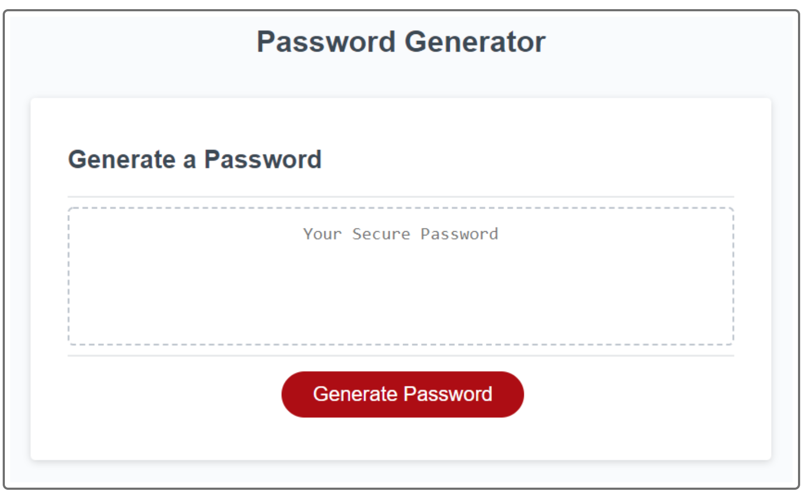

# <u>Password Generator</u>

  
  
  
  

  ## <u>Table of Contents:</u>
  ### [License](#license)
  ### * [Description](#description)
  ### * [Installation](#install)
  ### * [Usage](#usage)
  ### * [Contributors](#contributors)
  ### * [Testing](#testing)
  ### * [Questions](#questions)

  ## License
  ### MIT

  ## <u>Description</u>
  ### The project allows users to create a secure password based off of different parameters choosen. 
  
  ## Built With
    HTML
    CSS
    JAVASCRIPT

  ## <u>Installation:</u>
  ### Please follow these steps to install:
  ### No installation needed, simply go to the deployed site: https://alexdefrese.github.io/Defrese-pass-gen/

  ## <u>Usage:</u>
  ### After going to the deployed site, click 'generate password' and follow the prompts. 

  ## <u>Contributors:</u> 
  ### Alex Defrese

  ## <u>Testing:</u>
  ### Please follow these steps to test the project:
  ### Try to enter in no valid responses to the prompts. 

  ## <u>Questions:</u> 
  ### If you have any questions or suggestions, please contact me through either
  ### GitHub: https://github.com/Alex Defrese
  ### or
  ### Email: aidandefrese@gmail.com
